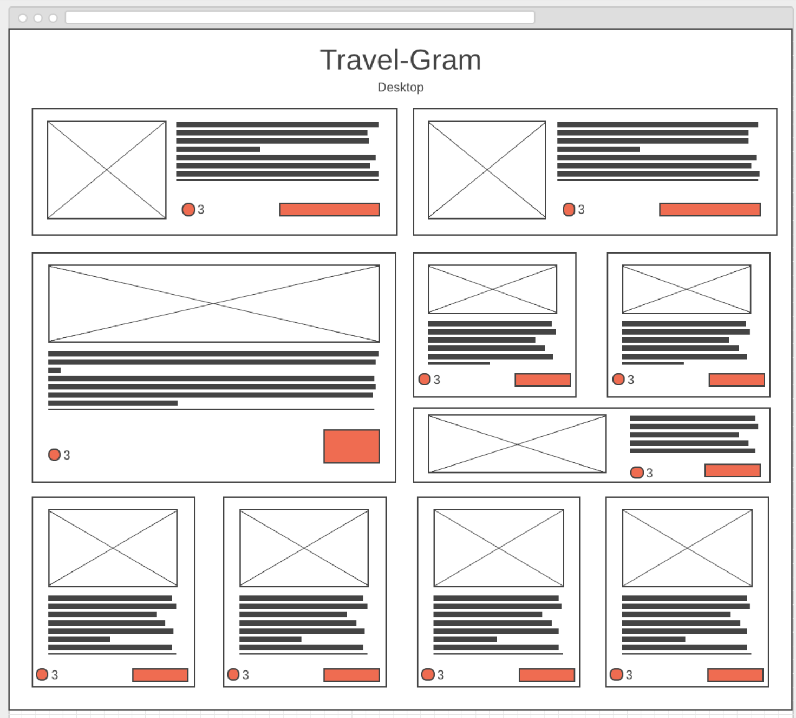
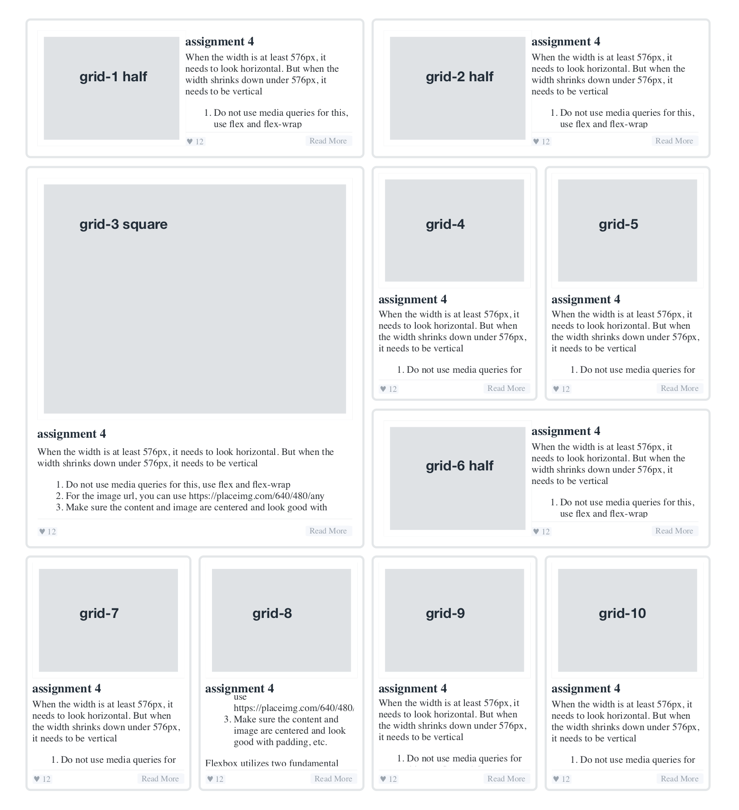

assignment notes

# CSS GRID
[view my assignment here](https://nntrn.github.io/dell-workbook/05grid/)


<details><summary>Project details</summary>

Using the flexbox cards from [assignment 4](https://nntrn.github.io/dell-workbook/04flexbox/), code this mockup using CSS Grid Areas



</details>



> the class names for the div blocks holding assignment 4 containers are displayed by setting `content: attr(class);` in the div's `:before`
>
> ```css
> div[class^="grid"]:before {
>    content: attr(class);
> }
>```


## setting up grid layout


<style>
.notes-css-grid{margin:2% auto; display:grid; grid-template-columns:repeat(4, 1fr); grid-template-rows:repeat(4, 1fr); height:300px; width:300px; font-size:.8em; line-height:110%; font-family:helvetica neue, roboto, arial, sans-serif; border:1px solid gray }

div[class^="grid-"]{content:attr(class); border:1px solid #dfe3e6; content:attr(class); color:black; padding:5%; }

div[class^="grid-"]:before{content:attr(class); font-size:1em; }

.notes-css-grid>div{border:2px solid #fff; background-color:#5a6872; color:#fff; }

.half { grid-column: 2 span;}
.square { grid-column: 2 span;  grid-row: 2 span;  }

</style>

```CSS
.css-grid {
    display: grid;
    grid-template-columns: repeat(4, 1fr);
    grid-template-rows: repeat(4, 1fr);
}
```

### this is what your skeleton should look like when you create 10 `<div>`s in a grid container

<div class="notes-css-grid">
<div class="grid-1"></div>
<div class="grid-2"></div>
<div class="grid-3"></div>
<div class="grid-4"></div>
<div class="grid-5"></div>
<div class="grid-6"></div>
<div class="grid-7"></div>
<div class="grid-8"></div>
<div class="grid-9"></div>
<div class="grid-10"></div>
</div>

<details><summary>expand code</summary>

```html
<div class="css-grid">
  <div class="grid-1"></div>
  <div class="grid-2"></div>
  <div class="grid-3"></div>
  <div class="grid-4"></div>
  <div class="grid-5"></div>
  <div class="grid-6"></div>
  <div class="grid-7"></div>
  <div class="grid-8"></div>
  <div class="grid-9"></div>
  <div class="grid-10"></div>
</div>
```
</details>


### create classes to use with CSS grids

* create a class for columns that are **2 columns wide**: this is needed for `grid-1`, `grid-2`, `grid-6`
* create a class for grids that are **2 columns wide x 2 rows long**: this is needed for `grid-1`, `grid-2`, `grid-6`


<div class="notes-css-grid">
<div class="grid-1 half"></div>
<div class="grid-2 half"></div>
<div class="grid-3 square"></div>
<div class="grid-4"></div>
<div class="grid-5"></div>
<div class="grid-6 half"></div>
<div class="grid-7"></div>
<div class="grid-8"></div>
<div class="grid-9"></div>
<div class="grid-10"></div>
</div>

<details><summary>expand code</summary>

```CSS
.half { grid-column: 2 span; }
.square { grid-column: 2 span;  grid-row: 2 span;  }
```

```html
<div class="css-grid">
  <div class="grid-1 half"></div>
  <div class="grid-2 half"></div>
  <div class="grid-3 square"></div>
  <div class="grid-4"></div>
  <div class="grid-5"></div>
  <div class="grid-6 half"></div>
  <div class="grid-7"></div>
  <div class="grid-8"></div>
  <div class="grid-9"></div>
  <div class="grid-10"></div>
</div>
```

</details>

> The `span` keyword is used to define how many grid tracks an element should span.

## inserting  flexbox template using jquery

you could copy and paste your flexbox code for all 10 divs ***OR*** you can save 10 x 140 lines of code  and load them into your grid blocks using javascript/jquery


---

## some notes about css grids

### Use `vmin` for an equal sized box layout

```CSS
.gridcontainer {
  display: grid;
  width: 100vw;
  height: 100vh;
  justify-content: center;
  align-content: center;
  grid-template-columns: repeat(5, 20vmin);
  grid-template-rows: repeat(5, 20vmin);
}
```

### CDN vs local file


The CDN should be used for all static files (.css/.js/images).

* Sometimes however javascript or css files can have dynamic aspect to them such as that it would include a unique user string or something of that sort. 
* In this situation the CDN server would have to contact the origin server on every request which would defeat the purpose.

[source](https://webmasters.stackexchange.com/a/92103)


## CSS GRIDS
* Flexbox make it really easy to build responsive layouts. I hope you can see why I prefer using it over floats.
* Flexbox deals with layouts in one dimension at the time ― either as a row or as a column. This is in contrast to CSS Grid Layout, which allows you to use rows and columns at the same time. 

```HTML
<article>
  <h1>Lorem ipsum dolor sit amet</h1>
  <p class="description">Sed ut perspiciatis unde </p>
  <p>Lorem ipsum dolor sit amet </p>
  <figure class="right">
   
   <figcaption>Duis aute irure </figcaption>
  </figure>
  <p>Sed ut perspiciatis </p>
  <footer>
    Some meta data
    Some meta data
    Some meta data
  </footer>
</article>
```
We apply a grid layout to the entire article and give it 7 columns:

```CSS
article {
  display: grid;
  grid-template-columns: 1fr 200px 10px minmax(320px, 640px) 10px 200px 1fr;
}
```


`display: grid`
: sets the article to be a grid container

`grid-template-columns`
: defines the different columns in our grid
example:
`grid-template-columns:`
`1fr 200px 10px minmax(320px, 640px) 10px 200px 1fr;`


https://make.wordpress.org/core/handbook/best-practices/coding-standards/javascript/